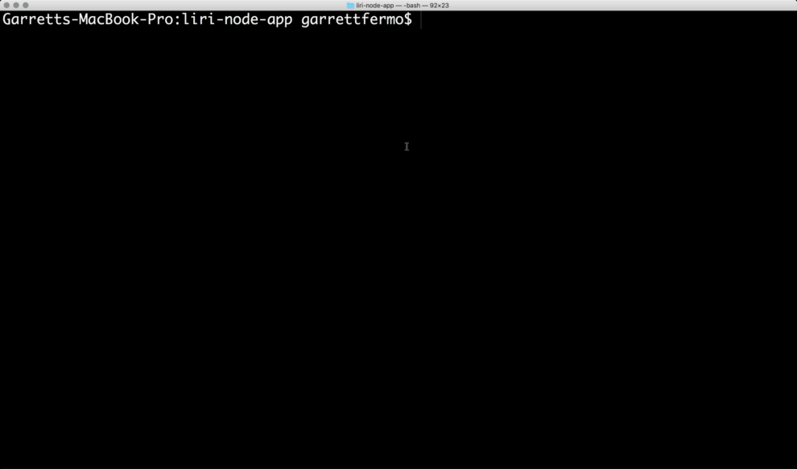
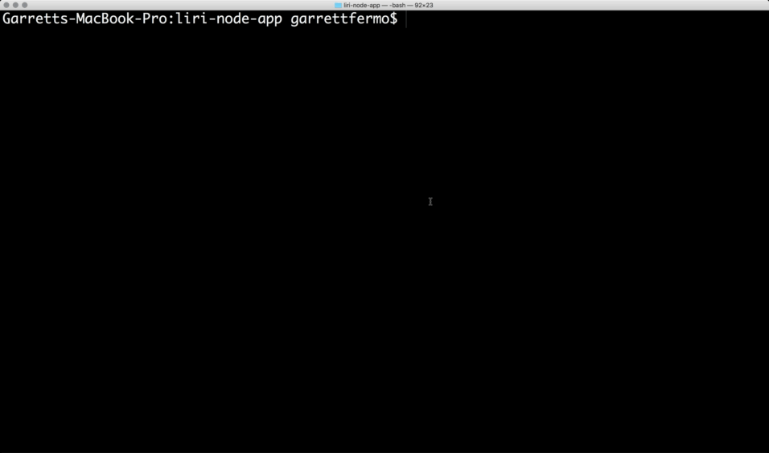
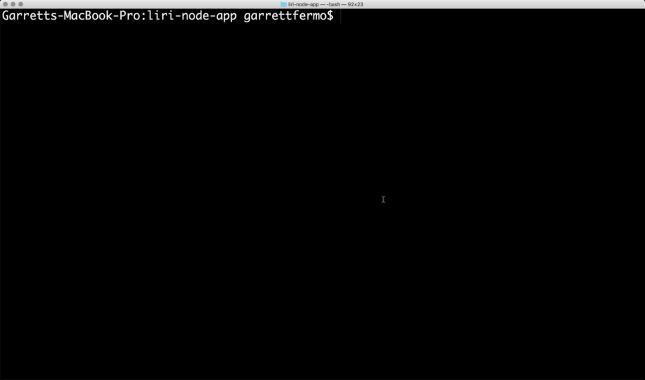

# LIRI Bot

## Application Overview:

LIRI is like is Language Interpretation and Recognition Interface. LIRI will be a command line node app that takes in parameters and gives you back data.

There are 4 types of data that you can request. Please see below:

* Movie Request - Simply provide a movie title that you want information for and you will recieve the following data:
  * Movie Title
  * Released Date
  * IMDB Rating
  * Rotten Tomatoes
  * Produced Country
  * Language
  * Plot
  * Actors

* Song Request - Simply provide a song name that you want information for and you will recieve the following data:
  * Artist Name
  * Album Name
  * Song Name
  * Preview URL of Song


* Concert Request - Simply provide a Band/Artists name that you want information for and you will recieve the following data:
  * Venue Name
  * Venue Location
  * Venue Date / Time

* (Special Request) - There is a special way where you can request information by reading in a text file with parameters. More details in the examples breakout

## Requirements:

Making the Application running correctly requires a couple of things that you will to install or request before it will work correctly. Please see the list below:


1. [Node.Js](https://nodejs.org/en/)

2. [NPM packages](https://www.npmjs.com/)
      * [Request](https://www.npmjs.com/package/request)
      * [Node-spotify-api](https://www.npmjs.com/package/node-spotify-api)
      * [Moment](https://www.npmjs.com/package/moment)
      * [Inquirer](https://www.npmjs.com/package/inquirer)
      * [Clear](https://www.npmjs.com/package/clear)
      * [Dotenv](https://www.npmjs.com/package/dotenv)

  3. API Keys
      * [Spotify API](https://developer.spotify.com/my-applications/#!/)
      * [OMDB API](http://www.omdbapi.com)
      * [Bands In Town API](http://www.artists.bandsintown.com/bandsintown-api)

## Examples:

Once you have all of the requirements and have cloned the github repository. You will be ready to run the application on your command line. Below are 4 examples of the request you can back.

*  Movie Request

* Song Request
 

* Concert Request


* Special Request
  * The special request you will provide a file with the parameters of what kind of information you are looking for.

  Random.txt (Examples)
  ```
  Find Movie Information,Batman
  ```
  ```
  Find Song Information,Bluebird
  ```
  ```
  Find Band/Artist's next concert,DirtyHeads
  ```
  


## Other Information:

There is a file that will log all request made on the application with a request time stamp on it. Please see the examples of the log text below,

```
Your Spotify Results for Lady Sublime!
_______________________
Artist Name : Mango Kingz
Album Name : Lady Sublime
Song Name : Lady Sublime
Preview : https://p.scdn.co/mp3-preview/1dc55a8ec84a8a1af2344d7ce8d48a55a21c8d39?cid=7661ac753f0f42869cc990bb8cc88514

Requested : October 8th 2018, 9:58:20 pm
_______________________

Your Movie Results for Happy Gilmore!
_______________________
Movie Title : Happy Gilmore
Released Date : 1996
IMDB Rating : 7.0
Rotten Tomatoes Rating : 60%
Produced Country : USA
Language : English
Plot : A rejected hockey player puts his skills to the golf course to save his grandmother's house.
Actors : Adam Sandler, Christopher McDonald, Julie Bowen, Frances Bay

Requested : 10/08/2018, 10:13:05 pm
_______________________


Your Concert Results for The Killers!
_______________________
Venue Name : iHeartRadio ALTer Ego 2019
Venue Location : Los Angeles
Date : 01/19/2019, 7:30 pm

Requested : 10/08/2018, 10:16:31 pm
_______________________


Your Movie Results for Batman!
_______________________
Movie Title : Batman
Released Date : 1989
IMDB Rating : 7.6
Rotten Tomatoes Rating : 72%
Produced Country : USA, UK
Language : English, French, Spanish
Plot : The Dark Knight of Gotham City begins his war on crime with his first major enemy being the clownishly homicidal Joker.
Actors : Michael Keaton, Jack Nicholson, Kim Basinger, Robert Wuhl

Requested : 10/08/2018, 10:25:13 pm
_______________________
```


## Enjoy the LIRI Bot!!!!